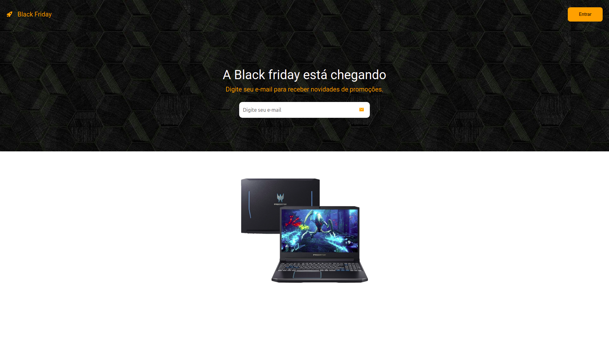

<h1 align="center">🔶 <a href="https://black-friday-academy.netlify.app">Black Friday</a></h1>
<p align="center" id="objetivo">Landing Page for the first challenge of Gama Academy.</p>

<div align="center" gap="10px">
  
  
  
  
</div>

<h1 align="center">
    <a href="https://reactnative.dev/">  React</a>
</h1>
<p align="center">🚀 A JavaScript library for creating user interfaces.</p>

<p align="center">
 <a href="#layout">Layout</a> •
 <a href="#features">Features</a> •
 <a href="#roadmap">How it works</a> • 
 <a href="#tecnologias">Tech Stack</a> • 
 <a href="#author">Author</a>
</p>

<h4 align="center"> 
	🚧  React App 🚀 Finished 🚧
</h4>

---

 <h3 align="center"><a href="https://black-friday-academy.netlify.app">https://black-friday-academy.netlify.app</a></h3>

---

<div style='margin: 20px' id="layout">
  <h1 align="center">
    
  </h1>
</div>

<div id="features">

---

## ⚙️ How it Works

- [x] User can enter their email to receive news.
- [x] On the computer, the user can leave the mouse over the product to see it, otherwise the items continued to pass.
- [x] On the mobile the user can swipe to see the items.

---

</div>

<div id="roadmap">

### Pre-requisites

Before you begin, you will need to have the following tools installed on your machine:
[Git](https://git-scm.com), [Node.js](https://nodejs.org/en/).
In addition, it is good to have an editor to work with the code like [VSCode](https://code.visualstudio.com/)

### 🎲 Running the web application (FrontEnd)

```bash
# Clone this repository
$ git clone git@github.com:danhenriquex/LandingPage-GamaAcademy.git

# Access the project folder in your terminal/cmd
$ cd LandingPage-GamaAcademy

# Install the dependencies
$ yarn install

# Run the application in development mode
$ yarn start


```


</div>

</div>

---

<div id="tecnologias">

### 🛠 Tech Stack

The following tools were used in the construction of the project:

- [Node.js](https://nodejs.org/en/)
- [React](https://pt-br.reactjs.org/)
- [TypeScript](https://www.typescriptlang.org/)
- [styled](https://styled-components.com)
</div>

### Author

---

<!-- <script type="text/javascript" src="https://platform.linkedin.com/badges/js/profile.js" async defer></script> -->

<div align="left" id="author">

<a href="https://github.com/danhenriquex">
  
</a>

<!-- <div class="LI-profile-badge"  data-version="v1" data-size="medium" data-locale="pt_BR" data-type="vertical" data-theme="dark" data-vanity="danilo-henrique-santana"><a class="LI-simple-link" href='https://br.linkedin.com/in/danilo-henrique-santana?trk=profile-badge'>Danilo Henrique</a></div> -->
</div>

<div style="margin-top: 20px" >
  <a href="https://www.linkedin.com/in/danilo-henrique-480032167/">
    
  </a>
</div>

